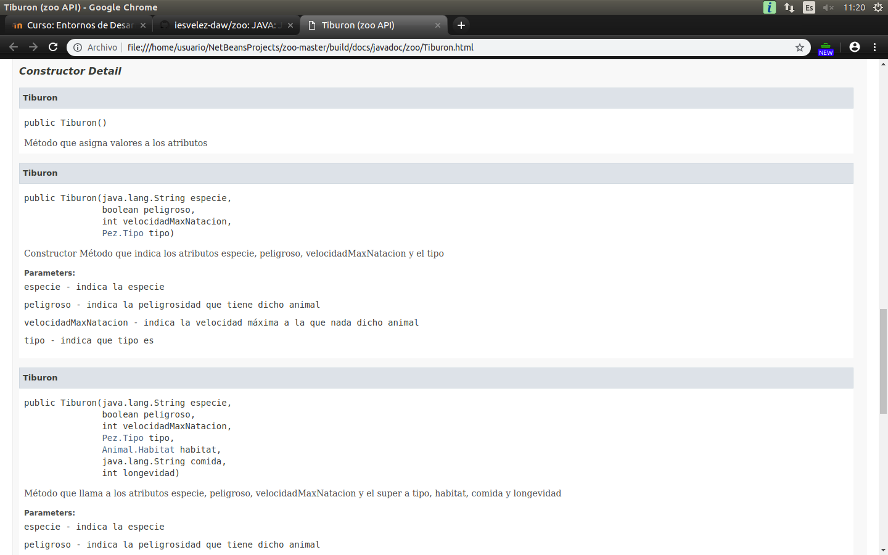
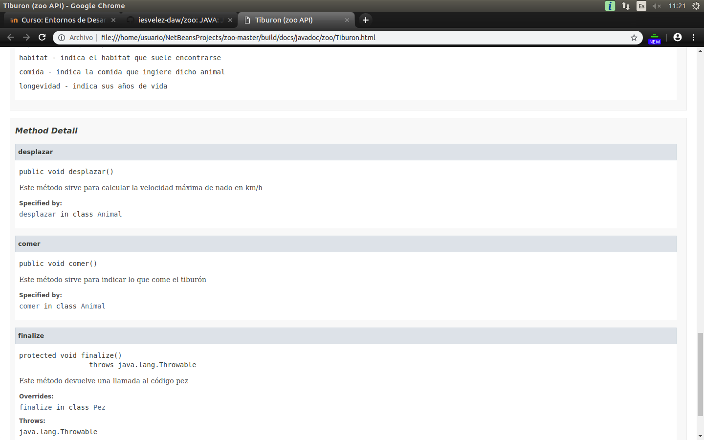
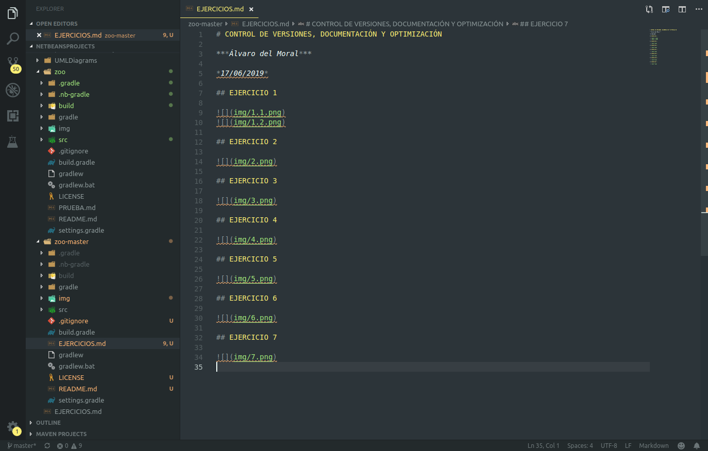
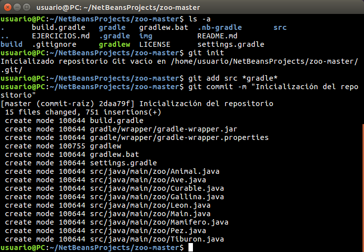
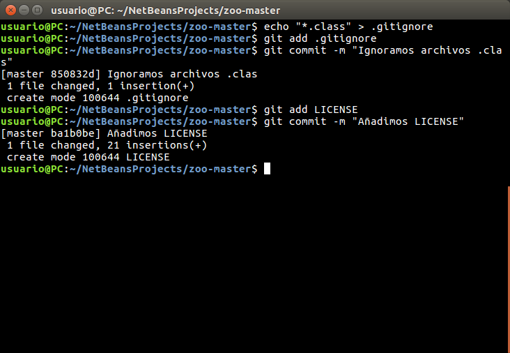

# CONTROL DE VERSIONES, DOCUMENTACIÓN Y OPTIMIZACIÓN

***Álvaro del Moral***

*17/06/2019*

## EJERCICIO 1

## EJERCICIO 2

## EJERCICIO 3

## EJERCICIO 4

## EJERCICIO 5

## EJERCICIO 6

## EJERCICIO 7

